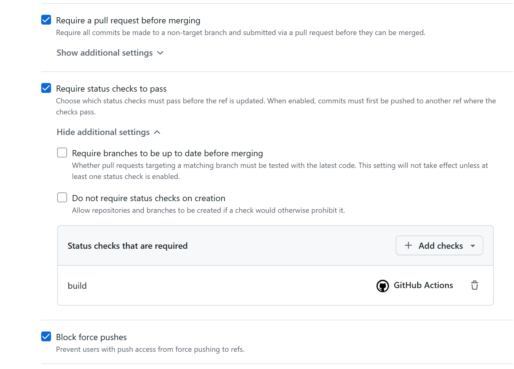
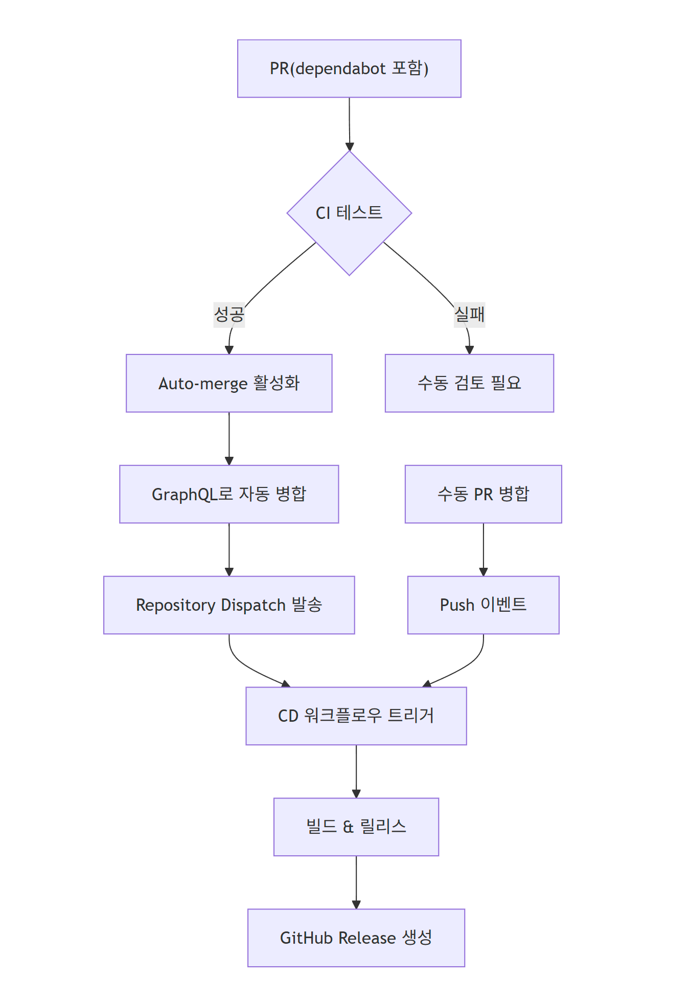

<style>
  section {
    font-size: 22px;
  }
  h1 {
    color: #2563eb;
    text-shadow: 2px 2px 5px rgba(0,0,0,0.1);
    font-size: 40px;
  }
  h2 {
    color: #1e40af;
    font-size: 32px;
  }
  h3 {
    font-size: 24px;
  }
  p, li {
    font-size: 20px;
    line-height: 1.4;
  }
  pre, code {
    font-size: 18px;
    line-height: 1.3;
  }
  .highlight {
    background: linear-gradient(135deg, #667eea 0%, #764ba2 100%);
    color: white;
    padding: 15px;
    border-radius: 10px;
    font-size: 20px;
  }
  .workflow-box {
    background: #f3f4f6;
    border-left: 4px solid #3b82f6;
    padding: 12px;
    margin: 8px 0;
    font-size: 18px;
  }
  .columns div {
    font-size: 18px;
  }
</style>

# 🚀 Automated Dependency Management & CI/CD with GitHub Actions

**완전 자동화된 개발 파이프라인 구축하기**

---

## 📋 목차

- 전체 아키텍처 개요
- Dependabot 자동 의존성 관리
- Auto-merge 워크플로우
- CI (Continuous Integration) 파이프라인
- CD (Continuous Deployment) 파이프라인
- 실제 구현 사례
- 베스트 프랙티스 & 팁

---

## 🏗️ 전체 아키텍처

<div class="highlight">
<h3>🔄 완전 자동화된 DevOps 파이프라인</h3>
</div>

<div class="columns">
<div>

**의존성 관리**
- Dependabot이 매일 체크
- 자동 PR 생성
- 자동 병합 처리

</div>
<div>

**CI/CD 파이프라인**  
- PR 생성 시 자동 테스트
- 병합 후 자동 빌드
- 릴리스 자동 배포

</div>
</div>

---

## 🤖 Dependabot 설정

### 핵심 구성 요소

```yaml
version: 2
updates:
  - package-ecosystem: "nuget"
    directory: "/"
    schedule:
      interval: "daily"
      time: "12:00"
      timezone: Asia/Seoul
```

<div class="workflow-box">
<strong>✨ 주요 기능</strong><br>
• NuGet 패키지 매일 자동 체크<br>
• GitHub Actions 의존성 관리<br>
• 그룹화된 업데이트 (한번에 여러 패키지)
</div>

---

## 🔄 Auto-merge 워크플로우

### 자동 병합 프로세스

<div class="columns">
<div>

**자동 병합 활성화**
- REST API 활용 (actions/github-script)
- MERGE 방식 사용
- CI 성공 후 자동 실행

</div>
</div>

---

## 🔧⚙️ 필요한 설정

**Github Branch Protection Rule**
- 브랜치 보호 규칙에 필요한 테스트 통과가 정의되어야 Automerge 기능 가능
- 해당 github actions job이 실행된 적이 있어야 해당 설정에서 검색 가능
- 목록이 보이는 게 아니니 검색어를 넣어봐야 함.

---


---


## 🔗 워크플로우 연계 메커니즘

### Repository Dispatch를 통한 PAT 없는 자동화

<div class="workflow-box">
<strong>🎯 핵심 해결책</strong><br>
• GITHUB_TOKEN만으로 완전 자동화<br>
• 별도 PAT 발급 불필요<br>
• Repository Dispatch 이벤트 활용
</div>

---

## 📡 Auto-merge → CD 연계 코드

### Repository Dispatch 이벤트 발송

```yaml
- name: Trigger CD workflow
  uses: actions/github-script@v7
  with:
    script: |
      const prNumber = ${{ steps.pr-info.outputs.pr-number }};
      const mergeSha = '${{ steps.merge-sha }}';
      await github.rest.repos.createDispatchEvent({
        owner: context.repo.owner,
        repo: context.repo.repo,
        event_type: 'PR-merged',
        client_payload: {
          pr_number: prNumber,
          merge_sha: mergeSha,
          merged_by: 'github-actions[bot]',
          merged_at: new Date().toISOString()
        }
      });
```

---

## 🚀 CD 워크플로우 트리거 설정

### 다중 트리거 이벤트 처리

```yaml
name: Continuous Deployment
on:
  workflow_dispatch:
  repository_dispatch:
    types: [PR-merged]
```

---

## 🎯 조건부 실행 로직

### 이벤트별 처리 방식

```yaml
jobs:
  deploy:
    if: github.event_name == 'repository_dispatch' || github.event_name == 'workflow_dispatch'
```

**이벤트 타입별 처리:**
- `push`: 일반 병합 시 (현재 비활성화)
- `repository_dispatch`: Auto-merge 시  
- `workflow_dispatch`: 수동 실행 시

**안전한 배포 보장:**
- 각 트리거별 적절한 동작
- 중복 실행 방지
- 조건부 실행으로 최적화

---

## 🛠️ CI (Continuous Integration)

### 테스트 자동화 파이프라인

<div class="workflow-box">
<strong>🎯 트리거 조건</strong><br>
• main 브랜치 대상 PR<br>
• 코드 파일 변경 시만 실행<br>
• 문서 파일 변경 시 제외
</div>

---

## 📝 CI 워크플로우 구성

### 스마트 트리거 설정

```yaml
name: CI tests
on:
  push:
    branches: ["main"]
    paths-ignore:
      - "**/*.md"
      - "**/*.txt"
      - "**/*.log"
      - "**/*.json"
      - "**/*.xml"
      - ".ai/**"
  pull_request:
    branches: ["main"]
    paths-ignore:
      - "**/*.md"
      - "**/*.txt"
      - "**/*.log"
      - "**/*.json"
      - "**/*.xml"
      - ".ai/**"
```

**핵심 포인트:**
- 문서 파일 변경 시 CI 스킵
- 리소스 효율적 사용  
- 개발자 경험 향상

---

## ⚡ CI 성능 최적화

### 캐싱과 테스트 실행

```yaml
jobs:
  build:
    runs-on: windows-2022
    steps:
    - uses: actions/checkout@v4
    - name: Get USERPROFILE and set CACHE_PATH
      shell: pwsh
      run: |
        $userProfile = [System.Environment]::GetEnvironmentVariable("USERPROFILE")
        $cachePath = Join-Path $userProfile ".nuget\packages"
        echo "CACHE_PATH=$cachePath" >> $env:GITHUB_ENV
    - name: Cache NuGet packages
      uses: actions/cache@v4
      with:
        path: |
          ~/.nuget/packages
          ${{ env.CACHE_PATH }}
        key: ${{ runner.os }}-nuget-${{ hashFiles('**/*.csproj', '**/*.sln') }}
        restore-keys: |
          ${{ runner.os }}-nuget-
    - run: dotnet restore simple-.net-Crypting-For-PowerBuilder.slnx
    - run: dotnet test simple-.net-Crypting-For-PowerBuilder.slnx --configuration Debug
```

---

**주요 최적화:**
- NuGet 패키지 캐싱으로 속도 향상
- Windows 환경에서 정확한 테스트
- 의존성 복원 최적화

---

## 🚀 CD (Continuous Deployment)

### 자동 배포 파이프라인

**트리거 이벤트:**
- repository_dispatch: `PR-merged` 이벤트
- workflow_dispatch: 수동 실행
- (옵션) push: 필요 시 활성화 가능

---

## 🔨 CD 빌드 과정

### Release 빌드 및 DLL 병합

```yaml
- name: Build solution for release
  run: dotnet publish simple-.net-Crypting-For-PowerBuilder.slnx --configuration Release

- name: Install ILMerge and ILRepack
  run: |
    nuget install ILMerge -Version 3.0.41 -OutputDirectory ${{ github.workspace }}\packages
    dotnet tool install -g dotnet-ilrepack

- name: Merge DLLs
  run: |
    # .NET Framework 4.8 (PowerBuilder)
    ilrepack /out:release-files\SecureLibrary-PB.dll `
            /union /copyattrs /internalize `
            /keyfile:Simple-Crypt4PB.snk `
            net481PB\bin\Release\net481\publish\SecureLibrary.dll `
            net481PB\bin\Release\net481\publish\BCrypt.Net-Next.dll

    # .NET Framework 4.8 (SQL Server) — ILMerge 사용
    packages\ILMerge.3.0.41\tools\net452\ILMerge.exe `
            /out:release-files\SecureLibrary-SQL.dll `
            /keyfile:Simple-Crypt4PB.snk `
            net481SQL-server\bin\Release\net481\publish\SecureLibrary.SQL.dll `
            net481SQL-server\bin\Release\net481\publish\BCrypt.Net-Next.dll

    # .NET 8 (Core)
    ilrepack /out:release-files\SecureLibrary-Core.dll `
            /union /internalize `
            /keyfile:Simple-Crypt4PB.snk `
            NET8\bin\Release\net8.0\publish\SecureLibrary-Core.dll `
            NET8\bin\Release\net8.0\publish\BCrypt.Net-Next.dll
```

**빌드 최적화:**
- 다중 타겟 동시 빌드
- DLL 병합으로 배포 간소화
- Strong Name 서명 적용

---

## 🏷️ 자동 버전 관리

### 버전 증가 및 릴리스 생성

```yaml
- name: Get latest release version and Generate release notes
  run: |
    $latest_release = (Invoke-RestMethod -Uri "https://api.github.com/repos/${{ github.repository }}/releases/latest").tag_name
    $versionParts = $latest_release.Split('.')
    $versionParts[-1] = [int]$versionParts[-1] + 1
    $newVersionString = $versionParts -join '.'
    $latestCommitMessages = (git log HEAD ^$latest_release --pretty=%B)
    foreach ($line in $latestCommitMessages) {
      if ($line -match "Update Version To (\d+\.\d+\.\d+)") {
        $newVersionString = $Matches[1]
      }
    }
    echo "new_release=$newVersionString" >> $env:GITHUB_ENV

- name: Create GitHub Release
  uses: softprops/action-gh-release@v2
  with:
    tag_name: ${{ env.new_release }}
    files: release-files/*
```

**릴리스 자동화:**
- 시맨틱 버저닝 자동 적용
- Git 로그 기반 릴리스 노트
- 아티팩트 자동 업로드

---

## 📦 실제 구현 사례

### .NET 다중 타겟 프로젝트

<div class="workflow-box">
<strong>🎯 프로젝트 구성</strong><br>
• .NET Framework 4.8 (PowerBuilder/SQL Server)<br>
• .NET 8 (Core)<br>
• 각각 최적화된 배포 파일 생성
</div>

**자동화된 배포물:**
- `SecureLibrary-PB.dll` (PowerBuilder용)
- `SecureLibrary-SQL.dll` (SQL Server용) 
- `SecureLibrary-Core.dll` (.NET 8용)

---

## 🧭 워크플로우 파일 한눈에 보기

**구성 파일 요약**

- `.github/workflows/ci.yaml`
  - Windows에서 테스트 실행, NuGet 캐시
  - `push`/`pull_request` 트리거, 문서/리소스 변경은 무시
  - 성공 시 repository dispatch로 `auto-merge-pr` 이벤트 발송

- `.github/workflows/auto-merge.yaml`
  - `repository_dispatch: auto-merge-pr` 수신 → PR 정보 조회 → 조건 검증 후 병합
  - 병합 후 repository dispatch로 `PR-merged` 이벤트 발송 (CD 트리거)

- `.github/workflows/cd.yaml`
  - `repository_dispatch: PR-merged` 또는 `workflow_dispatch` 시 릴리스 빌드/병합/배포
  - 아티팩트: PB/SQL/Core DLL 및 관련 파일, GitHub Release 업로드

---

## 📊 워크플로우 연동도

### 자동화된 DevOps 파이프라인 흐름



---

## 🔧 트러블슈팅: PAT 없는 완전 자동화

### 기존 문제점 분석

**❌ 일반적인 문제들:**
- Auto-merge 후 CD 워크플로우 미실행
- PAT 발급으로 인한 보안 취약점
- 워크플로우 간 연계 불가능
- 수동 개입 필요

---

## ✅ Repository Dispatch 해결책

### 완전 자동화 달성 방법

**핵심 장점:**
- GITHUB_TOKEN 권한만으로 충분
- 이벤트 기반 워크플로우 연계
- 완전 자동화 달성
- 보안 강화

**핵심 권한 설정:**
```yaml
permissions:
  pull-requests: write # Auto-merge 활성화
  contents: write      # 릴리스 생성
  actions: write       # Repository dispatch 발송
```

---

## ⚡ 성능 최적화

<div class="columns">
<div>

**캐싱 전략**
```yaml
- name: Cache NuGet packages
  uses: actions/cache@v4
  with:
    key: ${{ runner.os }}-nuget-${{ hashFiles('**/*.csproj') }}
```

</div>
<div>

**병렬 처리**
- 여러 타겟 동시 빌드
- 조건부 워크플로우 실행
- 스마트 트리거링

</div>
</div>

---

## 🔐 보안 고려사항

### 최소 권한 원칙

**필수 권한 목록:**
- `pull-requests: write` (auto-merge용)
- `contents: write` (릴리스용)
- `actions: write` (워크플로우 트리거용)

---

## 🛡️ 실제 권한 설정

### 워크플로우별 권한 구성

```yaml
# Auto-merge 워크플로우
permissions:
  pull-requests: write
  contents: write
  actions: write

# CD 워크플로우  
permissions:
  contents: write
  discussions: write
```

---

## 🔒 보안 강화 방법

### 다층 보안 전략

**핵심 보안 요소:**
- Repository secrets으로 민감 정보 관리
- GITHUB_TOKEN 권한 스코프 최소화
- 브랜치 보호 규칙 적용

**코드 서명:**
- Strong Name Key 활용
- 신뢰할 수 있는 어셈블리 생성
- 무결성 검증 강화 (release artifact hash)

---

## 📈 모니터링 & 알림 by Github

<div class="highlight">
<h3>🎯 실시간 모니터링</h3>
</div>

**자동 알림:**
- PR 상태 변경
- CI/CD 파이프라인 결과
- 릴리스 완료 통지

**아티팩트:**
- 릴리스 파일 관리
- 버전 히스토리 추적

---

## 🎯 베스트 프랙티스

<div class="columns">
<div>

**의존성 관리**
- 정기적인 업데이트 스케줄
- 그룹화된 업데이트
- 취약점 자동 패치

</div>
<div>

**CI/CD 최적화**
- 효율적인 캐싱
- 조건부 실행
- 병렬 작업 활용

</div>
</div>

**핵심 포인트:**
- 완전 자동화 달성
- 수동 개입 최소화
- 안정적인 배포 보장

---

## 🚀 결론

<div class="highlight">
<h3>✨ 완전 자동화된 DevOps 파이프라인의 장점</h3>
</div>

- **개발 생산성 향상:** 수동 작업 제거
- **보안 강화:** 자동 의존성 업데이트
- **안정성 증대:** 일관된 테스트 및 배포
- **시간 절약:** 반복 작업 자동화

---

## 🙋‍♂️ Q&A

<div style="text-align: center; margin-top: 100px;">
<h2>질문이 있으시면 언제든지!</h2>
<p style="font-size: 24px;">📧 GitHub Issues 또는 Discussions 활용</p>
</div> 