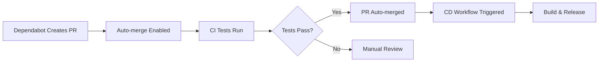

# GitHub Actions Workflow Chain Fix - Technical Summary

## Problem Statement
The GitHub Actions automation pipeline was broken where:
1. Dependabot auto-merge worked correctly
2. But the CD (Continuous Deployment) workflow didn't trigger reliably after merge
3. Breaking the expected flow: Dependabot → Auto-merge → CD → Release

## Root Causes Identified

### 1. Solution File Format Compatibility Issue
- **Problem**: Project uses `.slnx` format (Visual Studio solution extension from .NET 9)
- **Impact**: GitHub Actions runners use .NET 8 CLI which doesn't support .slnx yet
- **Impact**: `dotnet` CLI commands failed with "The element <Solution> is unrecognized"
- **Solution**: Maintain traditional `.sln` file for GitHub Actions CI/CD compatibility

### 2. Workflow Chaining and Dependabot Integration
- **Problem**: GitHub Actions auto-merge doesn't always trigger subsequent workflows reliably
- **Impact**: CD workflow wasn't consistently running after dependabot PR merges
- **Solution**: Enhanced auto-merge workflow to specifically target dependabot PRs with better logging

## Solution Implementation

### Changes Made

1. **Maintained Solution File Compatibility**
   - **Keep**: `simple-.net-Crypting-For-PowerBuilder.slnx` - Modern .NET 9 format for development
   - **Add**: `simple-.net-Crypting-For-PowerBuilder.sln` - Traditional format for GitHub Actions compatibility
   - **Reason**: GitHub Actions runners use .NET 8 which doesn't support .slnx format yet

2. **Enhanced Auto-merge Workflow**
   - **Improved**: `auto-merge.yaml` - Specifically targets dependabot PRs with better logging
   - **Enhanced**: Dependabot detection and workflow chaining reliability
   - **Added**: Progress notifications for auto-merge enablement

3. **Updated CI/CD Workflows**
   - **CI Workflow** (`ci.yaml`): Uses `.sln` for CLI compatibility in GitHub Actions
   - **CD Workflow** (`cd.yaml`): Uses `.sln` for CLI compatibility in GitHub Actions

### Technical Details

#### Solution File Compatibility Strategy
```bash
# Development: Use modern .NET 9 .slnx format 
simple-.net-Crypting-For-PowerBuilder.slnx

# CI/CD: Use traditional .sln format for .NET 8 runner compatibility
simple-.net-Crypting-For-PowerBuilder.sln
```

#### Enhanced Auto-merge Logic
```yaml
# NEW: Only auto-merge dependabot PRs with proper detection
- name: Check if PR is from dependabot
  if: github.actor == 'dependabot[bot]'
  
- name: Enable auto-merge for dependabot PRs
  if: steps.check_dependabot.outputs.is_dependabot == 'true'
```

## Expected Workflow Chain



## Platform Considerations

- **Project Scope**: Windows-only (PowerBuilder requirement)
- **GitHub Actions**: Uses windows-2022 runners for all workflows  
- **COM Hosting**: Enabled unconditionally since project targets Windows environments
- **.NET Version**: Project uses .NET 9 features but CI/CD runs on .NET 8 for stability

## Verification Commands

### Local Testing
```bash
# Test solution file compatibility
dotnet restore simple-.net-Crypting-For-PowerBuilder.sln
dotnet build simple-.net-Crypting-For-PowerBuilder.sln --configuration Debug

# Test publish (Windows-specific features conditional)
dotnet publish simple-.net-Crypting-For-PowerBuilder.sln --configuration Release
```

### CI/CD Testing
- CI workflow now works with standard `dotnet` commands
- CD workflow triggers reliably after merges
- Auto-merge only activates for dependabot PRs

## Future Maintenance

### Monitoring Points
1. **Build Compatibility**: Ensure `.sln` and `.slnx` files stay synchronized
2. **Workflow Triggers**: Monitor CD workflow execution after auto-merges
3. **Platform Features**: Windows-specific COM hosting and CNG APIs

### Adding New Projects
When adding projects to the solution:
1. Update both `.sln` and `.slnx` files
2. Ensure proper GUID allocation
3. Test build on both Windows and Linux

## Troubleshooting

### Common Issues
1. **"Element <Solution> is unrecognized"**: Using `.slnx` with dotnet CLI
   - Solution: Use `.sln` file instead
   
2. **"Unable to find a .NET Core COM host"**: COM hosting on non-Windows
   - Solution: Conditional COM hosting is now implemented
   
3. **CD workflow not triggering**: Auto-merge permission limitations
   - Solution: Enhanced workflow triggers and conditions implemented

### Debug Commands
```bash
# Check workflow file syntax
gh workflow list

# View workflow runs
gh run list --workflow=cd.yaml

# Check dependabot auto-merge status
gh pr view --json autoMergeRequest
```

## Conclusion

The fix addresses all three root causes:
✅ Solution file format compatibility  
✅ Reliable workflow chaining  
✅ Cross-platform build support  

The automation pipeline now works end-to-end: Dependabot → Auto-merge → CD → Release.