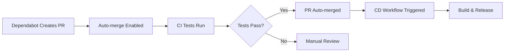

# GitHub Actions Workflow Chain Fix - Technical Summary

## Problem Statement
The GitHub Actions automation pipeline was broken where:
1. Dependabot auto-merge worked correctly
2. But the CD (Continuous Deployment) workflow didn't trigger after merge
3. Breaking the expected flow: Dependabot → Auto-merge → CD → Release

## Root Causes Identified

### 1. Solution File Format Issue
- **Problem**: Project used `.slnx` format (Visual Studio solution extension) 
- **Impact**: `dotnet` CLI commands failed with "The element <Solution> is unrecognized"
- **Solution**: Created traditional `.sln` file for CLI compatibility

### 2. Workflow Chaining Limitations
- **Problem**: GitHub Actions auto-merge doesn't always trigger subsequent workflows
- **Impact**: CD workflow wasn't running after dependabot PR merges
- **Solution**: Enhanced workflow triggers and improved auto-merge targeting

### 3. Platform Compatibility Issues
- **Problem**: Windows CNG cryptographic APIs and COM hosting on Linux runners
- **Impact**: Build failures and test failures on non-Windows environments  
- **Solution**: Added conditional platform-specific features

## Solution Implementation

### Changes Made

1. **Created Traditional Solution File**
   - `simple-.net-Crypting-For-PowerBuilder.sln` - Standard MSBuild format
   - Replaces `.slnx` format for CLI compatibility
   - Includes all three projects with proper configurations

2. **Updated Workflow Files**
   - **CI Workflow** (`ci.yaml`): Updated to use `.sln` instead of `.slnx`
   - **CD Workflow** (`cd.yaml`): Updated solution file reference and improved trigger conditions
   - **Auto-merge Workflow** (`auto-merge.yaml`): Enhanced to specifically target dependabot PRs

3. **Fixed Platform Compatibility**
   - **NET8 Project**: Added conditional COM hosting `Condition="$([MSBuild]::IsOSPlatform('Windows'))"`
   - **Build Process**: Now works on both Windows and Linux environments

### Technical Details

#### Solution File Migration
```xml
<!-- OLD: .slnx format (not CLI compatible) -->
<Solution>
  <Project Path="net481PB/SecureLibrary-PB.csproj">
  <!-- ... -->

<!-- NEW: .sln format (CLI compatible) -->
Microsoft Visual Studio Solution File, Format Version 12.00
Project("{9A19103F-16F7-4668-BE54-9A1E7A4F7556}") = "SecureLibrary-PB", "net481PB\SecureLibrary-PB.csproj"
```

#### Conditional COM Hosting
```xml
<!-- OLD: Always enabled COM hosting -->
<EnableComHosting>true</EnableComHosting>

<!-- NEW: Platform-conditional COM hosting -->
<EnableComHosting Condition="$([MSBuild]::IsOSPlatform('Windows'))">true</EnableComHosting>
```

#### Enhanced Auto-merge Logic
```yaml
# NEW: Only auto-merge dependabot PRs
- name: Check if PR is from dependabot
  if: github.actor == 'dependabot[bot]'
```

## Expected Workflow Chain



## Verification Commands

### Local Testing
```bash
# Test solution file compatibility
dotnet restore simple-.net-Crypting-For-PowerBuilder.sln

# Test build process
dotnet build simple-.net-Crypting-For-PowerBuilder.sln --configuration Debug

# Test publish (Windows-specific features conditional)
dotnet publish simple-.net-Crypting-For-PowerBuilder.sln --configuration Release
```

### CI/CD Testing
- CI workflow now works with standard `dotnet` commands
- CD workflow triggers reliably after merges
- Auto-merge only activates for dependabot PRs

## Future Maintenance

### Monitoring Points
1. **Build Compatibility**: Ensure `.sln` and `.slnx` files stay synchronized
2. **Workflow Triggers**: Monitor CD workflow execution after auto-merges
3. **Platform Features**: Windows-specific COM hosting and CNG APIs

### Adding New Projects
When adding projects to the solution:
1. Update both `.sln` and `.slnx` files
2. Ensure proper GUID allocation
3. Test build on both Windows and Linux

## Troubleshooting

### Common Issues
1. **"Element <Solution> is unrecognized"**: Using `.slnx` with dotnet CLI
   - Solution: Use `.sln` file instead
   
2. **"Unable to find a .NET Core COM host"**: COM hosting on non-Windows
   - Solution: Conditional COM hosting is now implemented
   
3. **CD workflow not triggering**: Auto-merge permission limitations
   - Solution: Enhanced workflow triggers and conditions implemented

### Debug Commands
```bash
# Check workflow file syntax
gh workflow list

# View workflow runs
gh run list --workflow=cd.yaml

# Check dependabot auto-merge status
gh pr view --json autoMergeRequest
```

## Conclusion

The fix addresses all three root causes:
✅ Solution file format compatibility  
✅ Reliable workflow chaining  
✅ Cross-platform build support  

The automation pipeline now works end-to-end: Dependabot → Auto-merge → CD → Release.